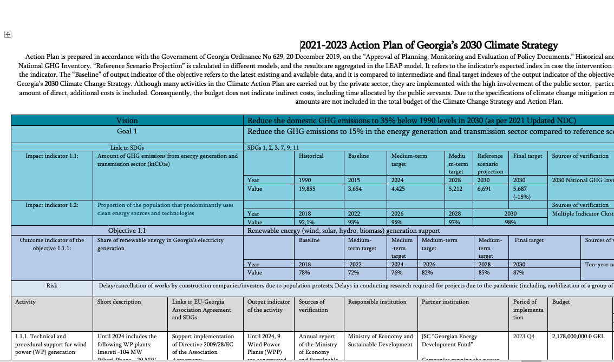
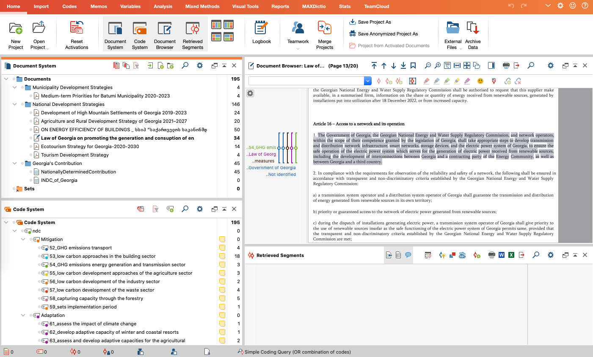

```{r setup, include=FALSE}
knitr::opts_chunk$set(echo = FALSE)
library(tidyverse)
library(ggplot2)
library(tinytex)
library(collapsibleTree)
library(viridis)
library(ggwordcloud)
library(treemapify)
```

```{css }
.title-slide hgroup h1 {
  font-size: 34px;
  letter-spacing: 0;
}
```


## Research purpose 

The traceability/translation of international climate commitments to national and local climate plans.


## Data collection

- Action plan 
- Policy documents (development strategies)
- Law


## Data analysis tools

- [R/Rstudio](https://www.rstudio.com/), packages: ggplot2, tidyverse, collapsibleTree, treemapify
- [MAXQDA](https://www.maxqda.de/)


## Action plan documents

{width=80%}


## Action plan table

```{r   }

ClimateAction <- readr::read_csv("Data/ClimateAction.csv",
                                 col_types = cols(Goal = "c",
                                                  Objective = "c",
                                                  Activity = "c",
                                                  Institution = "c",
                                                  Abbreviation = "c",
                                                  Budget = "c",
                                                  Type_origin = "c",
                                                  Type = "c",
                                                  amount = "n",
                                                  Organization = "c"))


DT::datatable(ClimateAction, 
              #colnames = c("","Goal","Objective","Activity", "Institution", "Abbreviation", "Budget", "Type_origin", "Type", "amount", "Organization"),
              class = 'cell-border stripe',  filter = 'top', extensions = 'Scroller',
              options = list(deferRender = F, dom = 'tip',
                             columnDefs = list(list(className = 'dt-center', targets = 4)), 
                             scrollY = 200, scroller = TRUE, scrollX = T, pageLength = 4))
            


```


## Action plan|Data analysis and visualisation  


```{r   }


ClimateAction <- readr::read_csv("Data/ClimateAction.csv",
                                 col_types = cols(Goal = "c",
                                                  Objective = "c",
                                                  Activity = "c",
                                                  Institution = "c",
                                                  Abbreviation = "c",
                                                  Budget = "c",
                                                  Type_origin = "c",
                                                  Type = "c",
                                                  amount = "n",
                                                  Organization = "c"))


ClimateActionT <- ClimateAction %>%
  filter(amount > 0) %>%
  group_by() %>%
  mutate(Sum = sum(amount)) %>%
  ungroup() %>%
  mutate(Per = amount/Sum*100) 


collapsibleTreeSummary(
  ClimateActionT,
  hierarchy = c("Goal", "Institution", "Activity", "Type", "amount"),
  width = 2000,
  zoomable = TRUE,
  root = "NDC",
  attribute = "Per",
  tooltip = TRUE,
  maxPercent = 71.5
  )


```


## Action plan|Data analysis and visualisation  

```{r   warining=FALSE, message=FALSE}


Institution <- readr::read_csv("Data/ClimateAction.csv",
                                 col_types = cols(Goal = "c",
                                                  Objective = "c",
                                                  Activity = "c",
                                                  Institution = "c",
                                                  Abbreviation = "c",
                                                  Budget = "c",
                                                  Type_origin = "c",
                                                  Type = "c",
                                                  amount = "n",
                                                  Organization = "c"))


Institution_inst <- Institution %>%
                    dplyr::select(Goal, Objective, Activity, Abbreviation) %>%
                    dplyr::distinct() %>%
                    group_by(Goal, Abbreviation) %>%
                    summarise(Value = n())
                      

InstitutionChart <- ggplot(Institution_inst, aes(Abbreviation , Goal, fill =Value)) +
                    geom_tile() +
                    geom_text(aes(label = Value, color = Value), show.legend = FALSE)+
                    scale_color_viridis(option = "inferno", direction = 1,
                                        begin = 0, end = 1, discrete=FALSE)+
                    scale_fill_viridis(option = "viridis", direction = -1,
                                       begin = 0, end = 1, discrete=FALSE)+
                    theme(axis.title.x = element_text(colour="black", size=11, hjust=0.5),
                          axis.title.y = element_text(colour="black", size=11, hjust=0.5),
                          axis.text.x=element_text(angle = 90,  hjust=1, size=11, colour="black"),
                          axis.text.y=element_text(size=11, colour="black"),
                          plot.caption = element_text(size=9, colour="black", hjust=1),
                          plot.title=element_text(colour="black", size=14,  hjust=0),
                          legend.title=element_text(size=11),
                          legend.text=element_text(size=11),
                          legend.position="bottom",
                          legend.key.width = unit(3, "line"))+
                    xlab("Responsible Institutions")+
                    ylab("Nationally Determined Contributions")+ 
                    labs(title = "Number of Activities by Responsible Institution and NDC",
                         subtitle ="",
                         caption = "Source:Climate Change Action Plan for 2021-2023")+
                    labs(fill = "Number of Activitities")+
                    scale_x_discrete()

InstitutionChart


```

## Action plan|Data analysis and visualisation  

```{r   warining=FALSE, message=FALSE, warning=FALSE}


ClimateAction <- readr::read_csv("Data/ClimateAction.csv",
                                 col_types = cols(Goal = "c",
                                                  Objective = "c",
                                                  Activity = "c",
                                                  Institution = "c",
                                                  Abbreviation = "c",
                                                  Budget = "c",
                                                  Type_origin = "c",
                                                  Type = "c",
                                                  amount = "n",
                                                  Organization = "c"))


ClimateAction_badget <- ClimateAction %>%
                        filter(amount > 0) %>%
                        group_by(Goal, Type)  %>%
                        summarise(Amount = sum(amount)) %>%
                        group_by(Goal) %>%
                        mutate(Sum = sum(Amount)) %>%
                        ungroup() %>%
                        mutate(Per = Amount/Sum*100)%>%
                        mutate(per2 = round(Per, 1))%>%
                        mutate(per3 = paste0(per2, " %"))


  
treemap <- ggplot(ClimateAction_badget, aes(area = Amount, fill = Type)) +
           geom_treemap()+
           geom_treemap_text(aes(label = per3), fontface = "bold", colour = "white", place = "centre", grow = FALSE)+
           theme(plot.caption=element_text (hjust = 0,  face = "italic"))+
           labs(title = "Percentage distribution of finances by NDC’s mitigation goals and types of financial support",
                caption = "Note: Administrative costs by Government are not included")+
           scale_y_continuous(labels = scales::percent)+
           facet_wrap(vars(Goal))

treemap

```


## Coding in MAXQDA 

{width=80%}


## Findings in MAXQDA 

{width=80%}

## Challenges of policy analysis

Challenges of policy analysis:

- Missing information about 
  - Financial resources
  - Responsible institutions
  - Unstructured documents
- Availability latest version of the policy document 


## Thank you | Questions? 

temur.gugushvili155@sps.tsu.edu.ge 

[temurgugushvili.ge](https://temurgugushvili.ge/)

[Info about project](https://temurgugushvili.ge/project/ndctracker/)

[The data and visualizations are available at GitHub](https://github.com/Temurgugu/RNDCTracker)


